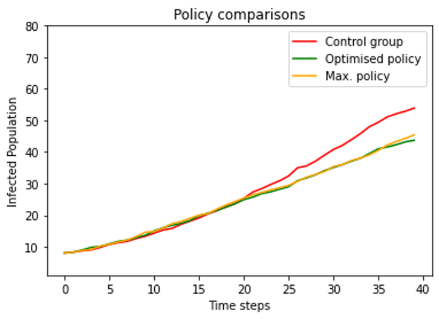

# Genetic optimization for pandemic policy-making.
Zachary Smith, MSc Artificial Intelligence

## Introduction
During the recent COVID-19 pandemic, governments created social and physical policies to reduce the spread of infection. Part of this policy was to maximise airflow in buildings, maintaining social distancing and wearing masks.
However, in some environments (e.g.: schools) these policies resulted in negative social impacts, particularly during cold winter months, as the policy was not particularly well suited to these settings. 

* Previous works have simulated given policies to measure their potential impacts on infection rates and economic loss. 
* We apply genetic optimisation to minimise infection rates in specific enclosed environments, whilst minimising negative social impacts.
* Our objectives were to minimise total infections and to negate social impacts, such as total open windows and social distancing requirements.

## Methodology
* We implemented a cellular automata to simulate agent movement, airborne infection, and airflow generated by windows.
* Used several popular genetic optimisers to explore the objective search space.
* Objectives were minimised by punishing solutions for maximising social distancing or maximising open windows.
* Testing was performed with an exemplar infection transmittable from contact and airborne inhalation. The environment was modelled to simulate a series of classrooms interconnected by a corridor.

## Testing

|Policy|Windows open|Social distancing (m)|Masking|
|:---:|:---:|:---:|:---:|
|Control.|0|0|False|
|Optimised.|5|1|True|
|Max.|17|2|True|

* Performance of optimised and max. policies against control group validate assumption that policy affects infection rates.
* The max. policy required opening all windows, etc., whilst the optimised policy achieved slightly improved infection rates with a lighter policy.

## Conclusion
* Genetic optimisation can optimise physical and social factors for specific environments to minimise infection rates.
* We find our genetic strategy is able to produce comparable or improved results to a maximising strategy, whilst creating less negative social impact.

## Poster

## TODO:
- [ ] Change simulations to run till infection rate stabilizes (all are infected).
- [ ] Run exemplar solutions for much longer - 30 or 100 reiterations instead of 10 - error bars on graphs
- [ ] Illustrate solutions - heatmap to show which windows are commonly open?
- [ ] Run till optimizer converges/produces better Pareto approximation.